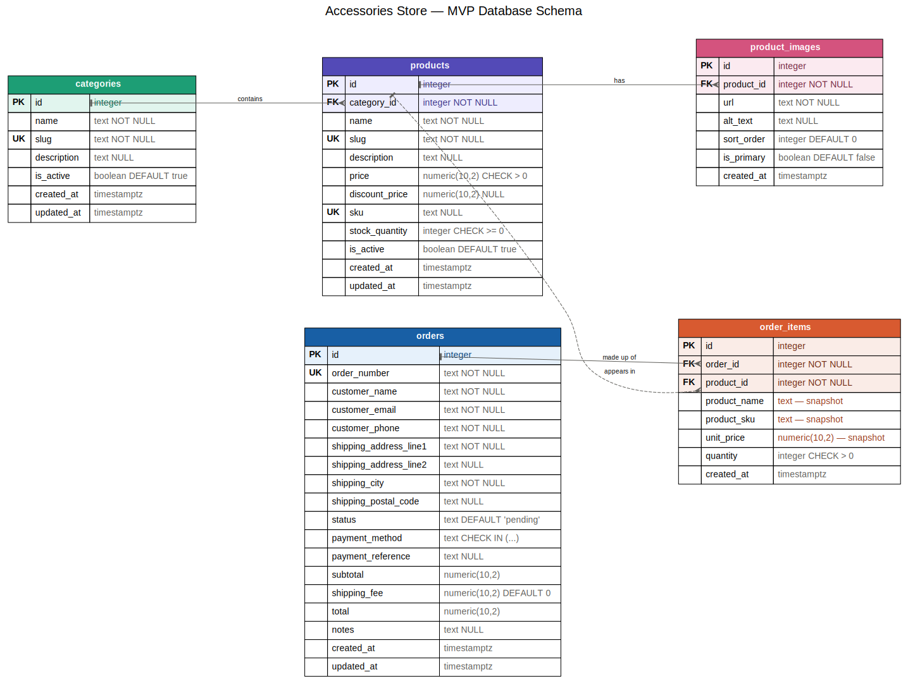

# Database Design — MVP

This document describes the database schema for the Accessories Store MVP.
It is the authoritative reference; the ER diagram is a simplified overview.

# ER Diagram

## Conventions

- Every table has a surrogate integer primary key named `id`.
- Money is always `NUMERIC(10,2)` — never a float.
- Timestamps are `TIMESTAMPTZ`, `NOT NULL`, defaulting to `now()`.
- Boolean columns are prefixed with `is_`.
- Foreign key columns are named `<table_singular>_id` and are indexed.
- Columns are `NOT NULL` unless "absent" is a genuinely meaningful state.

## Tables

### categories

Product categories. Only "Press-on Nails" exists at launch, but the table
exists so new categories are added as data, not as a redesign.

| Column | Type | Constraints |
|---|---|---|
| `id` | integer | PK |
| `name` | text | NOT NULL |
| `slug` | text | NOT NULL, UNIQUE |
| `description` | text | nullable |
| `is_active` | boolean | NOT NULL, DEFAULT true |
| `created_at` | timestamptz | NOT NULL, DEFAULT now() |
| `updated_at` | timestamptz | NOT NULL, DEFAULT now() |

### products

The core entity of the store.

| Column | Type | Constraints |
|---|---|---|
| `id` | integer | PK |
| `category_id` | integer | FK → categories(id), NOT NULL, ON DELETE RESTRICT, indexed |
| `name` | text | NOT NULL |
| `slug` | text | NOT NULL, UNIQUE |
| `description` | text | nullable |
| `price` | numeric(10,2) | NOT NULL, CHECK (price > 0) |
| `discount_price` | numeric(10,2) | nullable, CHECK (discount_price IS NULL OR discount_price < price) |
| `sku` | text | nullable, UNIQUE |
| `stock_quantity` | integer | NOT NULL, DEFAULT 0, CHECK (stock_quantity >= 0) |
| `is_active` | boolean | NOT NULL, DEFAULT true |
| `created_at` | timestamptz | NOT NULL, DEFAULT now() |
| `updated_at` | timestamptz | NOT NULL, DEFAULT now() |

Notes:
- `name` is intentionally **not** unique — the same name may legitimately be
  used across categories (e.g. "Rose Gold" nails and "Rose Gold" earrings).
  `sku` is the uniqueness guarantee.
- `is_active` controls visibility on the storefront and is independent of
  `stock_quantity`. A product can be in stock but hidden (draft), or listed
  but sold out.

### product_images

One product has many images.

| Column | Type | Constraints |
|---|---|---|
| `id` | integer | PK |
| `product_id` | integer | FK → products(id), NOT NULL, ON DELETE CASCADE, indexed |
| `url` | text | NOT NULL |
| `alt_text` | text | nullable |
| `sort_order` | integer | NOT NULL, DEFAULT 0 |
| `is_primary` | boolean | NOT NULL, DEFAULT false |
| `created_at` | timestamptz | NOT NULL, DEFAULT now() |

Notes:
- `ON DELETE CASCADE` is correct here (unlike on order items): an image has no
  meaning without its product and is not part of any historical record.
- `sort_order` controls display order; `is_primary` marks the catalogue thumbnail.

### orders

One row per customer purchase. This is a **historical record** — values are
snapshots of what was true at the time of purchase and must not change
retroactively.

There is no `users` table at launch (guest checkout only), so customer details
live directly on the order.

| Column | Type | Constraints |
|---|---|---|
| `id` | integer | PK |
| `order_number` | text | NOT NULL, UNIQUE, indexed |
| `customer_name` | text | NOT NULL |
| `customer_email` | text | NOT NULL |
| `customer_phone` | text | NOT NULL |
| `shipping_address_line1` | text | NOT NULL |
| `shipping_address_line2` | text | nullable |
| `shipping_city` | text | NOT NULL |
| `shipping_postal_code` | text | nullable |
| `status` | text | NOT NULL, DEFAULT 'pending', CHECK (see below), indexed |
| `payment_method` | text | NOT NULL, CHECK (payment_method IN ('cod', 'bank_transfer')) |
| `payment_reference` | text | nullable |
| `subtotal` | numeric(10,2) | NOT NULL, CHECK (subtotal >= 0) |
| `shipping_fee` | numeric(10,2) | NOT NULL, DEFAULT 0, CHECK (shipping_fee >= 0) |
| `total` | numeric(10,2) | NOT NULL, CHECK (total >= 0) |
| `notes` | text | nullable |
| `created_at` | timestamptz | NOT NULL, DEFAULT now() |
| `updated_at` | timestamptz | NOT NULL, DEFAULT now() |

Allowed `status` values:
`pending`, `paid`, `processing`, `shipped`, `delivered`, `cancelled`, `refunded`

Notes:
- `order_number` (e.g. `ORD-2026-0043`) is the public-facing identifier. `id` is
  internal only. Exposing `id` would leak total order volume.
- `customer_phone` is NOT NULL because Sri Lankan couriers require a phone
  number for COD delivery. `shipping_postal_code` is nullable because postal
  codes are inconsistently used locally.
- Addresses are flat columns rather than a separate `addresses` table: guests do
  not reuse addresses, and these are snapshots. An `addresses` table will be
  introduced alongside customer accounts.
- `payment_reference` records the bank transfer reference supplied by the
  customer, for reconciliation.

### order_items

Junction table resolving the many-to-many relationship between orders and
products. One row = one line on one order.

| Column | Type | Constraints |
|---|---|---|
| `id` | integer | PK |
| `order_id` | integer | FK → orders(id), NOT NULL, ON DELETE CASCADE, indexed |
| `product_id` | integer | FK → products(id), NOT NULL, ON DELETE RESTRICT, indexed |
| `product_name` | text | NOT NULL |
| `product_sku` | text | nullable |
| `unit_price` | numeric(10,2) | NOT NULL, CHECK (unit_price > 0) |
| `quantity` | integer | NOT NULL, CHECK (quantity > 0) |
| `created_at` | timestamptz | NOT NULL, DEFAULT now() |

Notes:
- `unit_price`, `product_name` and `product_sku` are **snapshots**, duplicated
  from `products` at the time of purchase (see Key Decisions below).
- `line_total` is deliberately **not** stored — it is `unit_price * quantity`,
  purely derived, with no historical justification.

## Relationships

| Relationship | Type | Implementation |
|---|---|---|
| categories → products | one-to-many | `products.category_id` |
| products → product_images | one-to-many | `product_images.product_id` |
| orders → order_items | one-to-many | `order_items.order_id` |
| products → order_items | one-to-many | `order_items.product_id` |
| orders ↔ products | many-to-many | resolved via `order_items` |

## Key Decisions

### 1. Snapshot principle for orders

An order is a historical record, not a live view of current data. Prices, product
names and SKUs are copied onto `order_items` at checkout rather than looked up
from `products`.

Without this, raising a product's price would retroactively rewrite every past
order — corrupting revenue reports, invoices and tax records silently. The
customer would see a price they never agreed to.

### 2. `orders.total` is deliberately denormalized

`total` is derivable from the line items, and storing derived data normally risks
the stored value disagreeing with the computed one.

It is stored anyway because the amount the customer actually agreed to pay is
itself a historical fact, incorporating shipping fees and (later) discounts and
coupons. The authoritative charged amount must be recorded, not recomputed.

This is denormalization with a stated justification, not convenience.

### 3. Soft delete, not hard delete

Products referenced by past orders cannot be deleted — `ON DELETE RESTRICT`
prevents it, and correctly so. `ON DELETE CASCADE` here would silently destroy
order history.

Products are therefore retired by setting `is_active = false`. They disappear
from the storefront while order history remains intact.

### 4. `status` as text + CHECK, not ENUM or lookup table

- A **lookup table** would be right if non-developers needed to add statuses
  through the UI. They do not.
- An **ENUM** welds the list into the database's type system; adding a value
  later means altering the type itself.
- A **CHECK constraint** gives the same guarantee and adding a value is a
  one-line migration.

The status list changes rarely and only by developer decision, which matches the
CHECK trade-off.

### 5. Database constraints in addition to application validation

Application validation provides good error messages; database constraints
provide guarantees. Every path into the data — the app, the admin panel, a
migration script, a manual `psql` session — is checked by the database. Both
layers are used, doing different jobs.

## Deferred

The following are intentionally out of scope for the MVP and will be added later
without redesign:

- `users` — customer accounts. `orders` gains a nullable `user_id`.
- `addresses` — saved addresses, once accounts exist.
- `tags` + `product_tags` — many-to-many, needed for search/filtering.
- `coupons`, `reviews`, `wishlists`.
- Payment provider records, once PayHere is integrated.